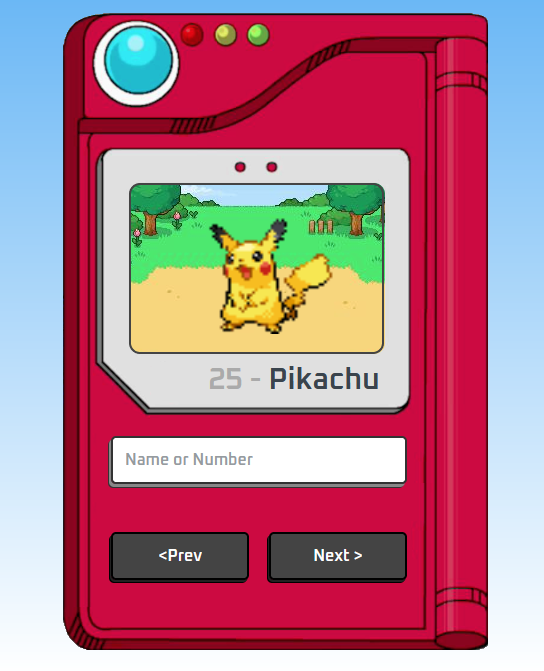

# JavaScript Pokédex

## Description

The JavaScript Pokédex is a basic Javascript, HTML and CSS web app made while studying similar projects.

The objective was to built an application using the fundamentals of web design, thus implementing it with only vanilla code.

## Playing with the Pokédex

To play with it just type a name or an id number for a Pokémon.

Valid entries are comprised of Pokémon from generations I through V (Pokémon Red/Blue - Pokémon Black/White).

You can also navigate the Pokédex with the buttons.

### Try the demo now!

Click on the [link](https://prospektsmarch22.github.io/pokedex-generation-v/) and try to the app for yourself! 
